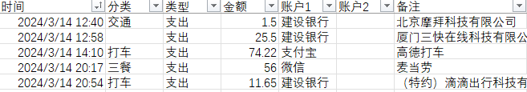

# 钱迹账单整理辅助脚本

本脚本工具支持将 支付宝，微信，建设银行三种 excel 账单自动整理成符合钱迹模板要求的 excel 文件，整理后的 excel 文件可以在钱迹 app（或 PC 端）一键导入。

为什么做这个？还不是因为懒。由于懒得在每笔消费后打开 app 记账，一般都是下月初导出上月的支付宝微信等 excel 账单整理成钱迹模板导入，但是手动复制粘贴整理成钱迹模板 excel 又太费时于是写了这个脚本。

除了提取已有账单数据整理写入到符合钱迹模板的 excel 文件外，本脚本还支持在 json 文件里配置关键字到分类的映射，也就是如果你的账单条目中的“备注”一栏包含了 json 中配置的关键字的话，会自动填入对应的分类。

## 使用命令：

`python qianji_helper_pandas.py input_dir`

支持指定输入目录，生成的结果也存在相同目录，如果不指定目录则读取当前目录下账单文件。

生成的 excel 文件内容截图：



## json 配置

如果账单的“备注”中包含左边的关键字，则会自动填写右边的“分类”

```json
{
  "食堂": "三餐",
  "麦当劳": "三餐",
  "滴滴": "打车",
  "摩拜": "交通",
  "铁路12306": "火车"
}
```
## 已知问题
1. 同名 excel 账单打开时无法写入新数据；
2. pandas 升级到2.0（具体哪个版本未确认）以上之后，部分数据无法写入，后期会修复。
